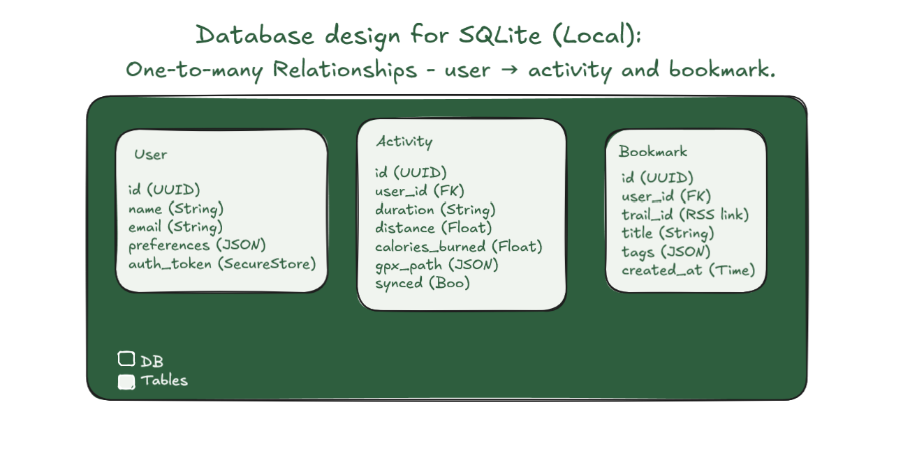

  

**Trailpace** is a mobile app for outdoor enthusiasts — explore trails, track activities, and stay connected with nature, even offline.

---

## ✨ Features

- 🗺️ **Offline-first Maps** – Custom vector tiles with MapLibre ✅
- 🏃 **Activity Tracking** – Distance, speed, time, calories ✅
- 🔖 **Trail Bookmarking & Sharing**
- 📰 **RSS Feed Integration** – Powered by Substack ✅
- 🎯 **Tag-based Trail Discovery** ✅

---

## 🧱 APP Architecture and DB Design Overview

  

  

---

## 📲 Try It Out

Get the latest APK release and explore the trails today:

👉 **[Download trailpace-v1.0.0.apk](https://github.com/luarakelly/trailpace-showcase/releases/latest)**

---

## 🧠 Tech Stack

| Layer            | Tech                              |
| ---------------- | --------------------------------- |
| Mobile Framework | React Native (Expo)               |
| Local Storage    | SQLite                            |
| Cloud Sync/Auth  | Supabase                          |
| Mapping Engine   | MapLibre GL + custom vector tiles |
| Content Feeds    | Substack RSS                      |

---

## 📄 Documentation

- 📘 [Architecture Overview](./docs/ARCHITECTURE.md)
- 🗃️ [Database Design](./docs/DATABASE.md)

---

## 🌲 Built for Trail Seekers

> “Where the path ends, the adventure begins.”  
> Trailpace helps you take the first step into the wild.

---
