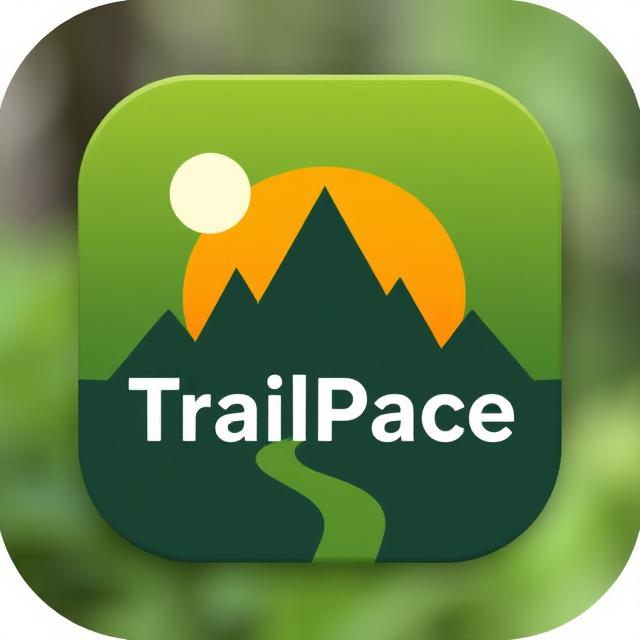
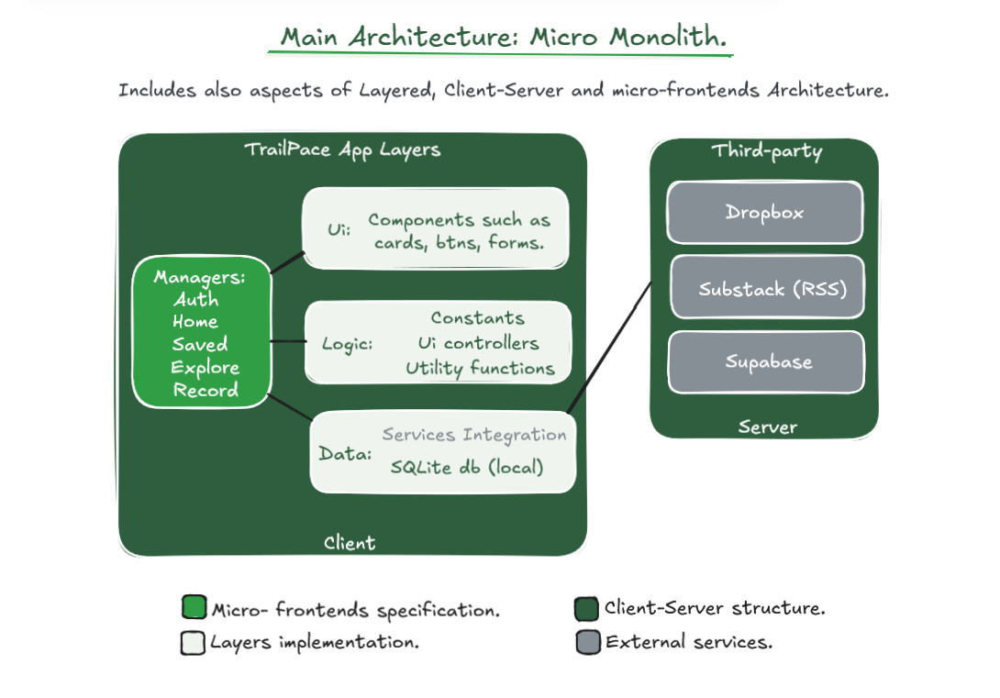

# Trailpace – Showcase

Is a mobile app for outdoor sports enthusiasts, offering offline maps, activity tracking, and trail discovery.

---

## 🔍 Features

- 🗺 Offline-first maps (MapLibre + custom vector tiles) ✅ basic func.
- 🏃 Activity tracking with distance, speed, time, calories ✅
- 🔖 Trail bookmarking and sharing
- 📰 Integrated RSS feed ✅
- 🎯 Tag-based trail search ✅

---

## 🧱 Architecture Overview

Trailpace uses a **Micro-Monolith** architecture, with:

- Layered separation (UI, Logic, Data)
- Micro frontend-like UI screen managers
- Local-first DB (SQLite)

---

## 📱 APK Preview

Download the latest release:  
👉 [trailpace-v1.0.0.apk](https://github.com/luarakelly/trailpace-showcase/releases/latest)

---

## 🧠 Tech Stack

- React Native (Expo)
- SQLite (local DB)
- Supabase (auth + sync)
- Substack RSS
- MapLibre GL + custom vector tiles

---

## 📄 Docs

- [Architecture](./docs/ARCHITECTURE.md)
- [Database Design](./docs/DATABASE.md)
